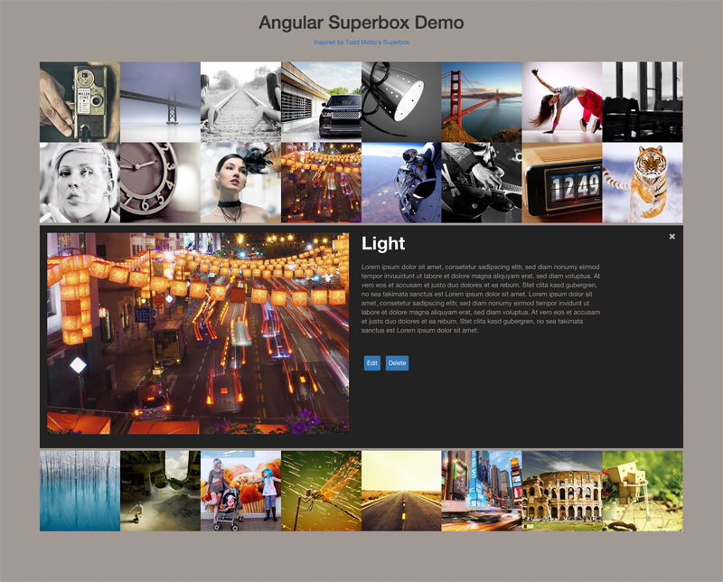
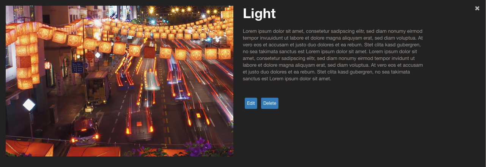

Angular-Superbox  
================

<!-- [![Build Status][travis-status]][travis-link] -->

AngularJS version of Superbox. You can find a demo [here](http://plnkr.co/edit/En92cV?p=preview).



### Installation

There's a [bower](http://bower.io/) package:

``` shell
bower install angular-superbox
```

### Basic Usage

``` html
<superbox superbox-model="images"></superbox>
```

The superbox-model attribute takes an array of objects with following properties:

``` javascript
    $scope.images = [
      {
        title: 'Camera',
        description: 'Camera description',
        alt: 'Alt',
        img_thumb: 'img/superbox/superbox-thumb-1.jpg',
        img_full: 'img/superbox/superbox-full-1.jpg'

      },
      {
        name: 'Bridge',
        description: 'Bridge description',
        alt: 'Alt',
        img_thumb: 'img/superbox/superbox-thumb-2.jpg',
        img_full: 'img/superbox/superbox-full-2.jpg'

      },
      ....
```
#### Field Mapping

If your data model is different, let's say instead of an image.title you have image.name, you can provide your own field mapping:

``` html
<superbox superbox-model="images" 
          superbox-actions="actions" 
          superbox-options="{fieldMapping: {title: 'name', description: 'desc'}}">
</superbox>
```

##### Actions
With the superbox-actions attribute you can add buttons for your actions on every image:




``` javascript

    function editEntry(entry) {
      alert('Edit on ' + entry.title + ' invoked.');
    }
    ...
    
    $scope.actions = [
      {
        label: 'Edit',
        action: editEntry
      },
      {
        label: 'Delete',
        action: deleteEntry
      }
    ];
```


[travis-status]: https://travis-ci.org/libreboard/libreboard.svg
[travis-link]: https://travis-ci.org/libreboard/libreboard.svg
